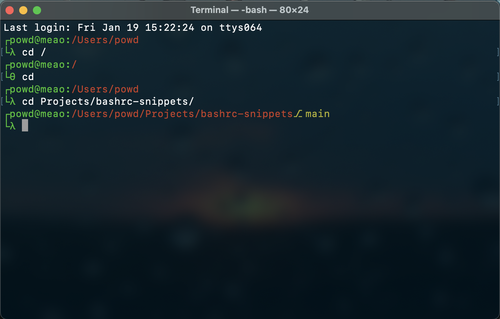

# `.bashrc` snippets

Copy and paste any of them into your `.bashrc` or `.bash_profile` if you find
them useful.&nbsp;🤝

More clarification on each snippet set can be found in the sections below.

> **Note**: For MacOS, many snippets won't work on the `zsh` shell. If you'd
> still like to use them, consider changing the default shell from `zsh` to
> `bash` (you might also want to use a snippet located in `bash_on_macos.sh` for
> that).

## Bash on macOS

Hides the deprecation warning.

> **Note**: TODO: What's the security of such an approach?

## Docker utilities

A set of Docker utilities (aliases and/or functions, collectively) that tend to
be used most frequently when working with Docker.

They are designed specifically to be **quickly typed** and
**easily memorized**.

The list of utilities:

- `qq` - an alias for `docker` ("qq" are the flipped "dd" letters that stand
  for "<u>d</u>ocker"; thus, a name collision with the `dd` program is
  avoided),
- `qqs` - an alias for `docker stop`,
- `qqr` - an alias for `docker rm`,
- `QQ` - an alias for `docker images`,
- `qqp` - similar to `docker-ps`, but without some columns and the table
  heading (which, for some users, tends to be more often used due to being able to fit in the narrower terminal),
- `qqpp` - an alias for `docker ps -a`,
- `qqppp` - an alias for `docker ps` (which, for some users, tends to be less
  often used due to not being able to fit in the narrower terminal),
- `qqx` - an alias for `docker exec -it` ("x" as in "e<u>x</u>ecute"),
- `qql` - an alias for `docker logs --follow` (which, for some users, tends to
  be more often used than without the `--follow` flag),
- `qqll` - prints out the logs from all the containers (with a `--follow`
  flag),
- `qqlll` - an alias for `docker logs` (which, for some users, tends to be less
  often used than with the `--follow` flag),
- `qqR` - an alias for `docker run`,
- `qqv` - an alias for `docker volume`,
- `qqvvv` - an alias for `docker volume ls`,
- `qqvr` - an alias for `docker volume rm`.
- `qqd CONTAINER_NAME` - stops and removes ("<u>d</u>estroys") the given
  container,
- `qqb CONTAINER_NAME` - logs into `bash` (executes `bash`) on the given
  container,
- `qqsh CONTAINER_NAME` - logs into `sh` (executes `sh`) on a given container,
- `qqss` - stops all the running containers,
- `qqrr` - removes all the running containers,
- `qqrrr` - removes all the running containers with a `-f` flag,
- `qqdd` - stops and removes ("<u>d</u>estroys") all the running containers,
- `qqddd` - stops and removes ("<u>d</u>estroys") all the running containers with a `-f` flag,
- `qquu` - alias for `docker-system-prune` ("u" as in "pr<u>u</u>ne"),
- `qquuv` - alias for `docker-volume-prune` ("u" as in "pr<u>u</u>ne"),
- `QQuu` - alias for `docker image prune -a`,
- `qqq CONTAINER_SEARCH_TERM` - outputs the ID of the first-found container
  name according to the passed search term,
- `qqqv CONTAINER_SEARCH_TERM` - outputs the ID of the first-found matching
  volume according to the passed search term,
- `QQQ IMAGE_SEARCH_TERM` - outputs the ID of the first-found image according
  to the passed search term,
- `qqqd CONTAINER_SEARCH_TERM` - stops and removes ("<u>d</u>estroys") the
  first-found container according to the passed search term,
- `qqqvr VOLUME_SEARCH_TERM` - removes the first-found volume according to the
  passed search term,
- `qqqb CONTAINER_SEARCH_TERM` - logs into `bash` (executes `bash`) of the
  first-found container according to the passed search term,
- `qqqB CONTAINER_SEARCH_TERM` - logs, as a `root` user, into `bash` (executes `bash`) of the first-found container according to the passed search term,
- `qqql CONTAINER_SEARCH_TERM` - prints out (with the `--follow` flag, which
  tends to be more often used by some users) the logs of the first-found
  container according to the passed search term,
- `qqqlll CONTAINER_SEARCH_TERM` - prints out (without the `--follow` flag,
  which tends to be less often used by some users) the logs of the first-found
  container according to the passed search term,
- `qqqx CONTAINER_SEARCH_TERM COMMAND` - executes a command of the first-found
  container according to the passed search term,
- `QQQR IMAGE_SEARCH_TERM` - runs the first-found image according to the passed
  search term.

Examples:

```bash
qqqb fro
```

```bash
qqqB bac
```

```bash
qqqx proxy ls
```

### Design explanation and mnemonics

In the following sections, the subsequent Docker utility segments are
explained.

#### Prefix (`qq...` or `qqq...`)

`qq` is a prefix for docker aliases ("flipped" to avoid colliding with the
"dd" program)

When triple `qqq` are used as a prefix, it means that first a search for a
substring is performed and then a given command is run on some found resource.

#### Command (e.g. `...p`, `...pp` or `...ppp`)

How do `qqp`, `qqpp` and `qqppp` (as well as other analogous commands)
compare to each other?

- One letter reflects a more-or-less basic command.
- Two letters reflect running command on all of the (passed-as-an-argument
  or found) resources.
- Three letters have a special meaning specific to the given command (e.g.
  `qqppp` runs a standard, i.e. more verbose, `docker-ps` variant whereas
  `qqvvv` runs `docker-volume-ls` and not just `docker-volume`).

#### Additional remarks

Also note that:

- The capital letters of the prefix (`QQ` or `QQQ`) mean that the
  alias/function concerns images instead of any other resources (being mostly
  containers).
- The alias/function name might be continued with an underscore to convey
  even more meaning. For example, `qqpp_inline_ids` has a very specific role
  (to list only IDs and put them in a single line) but is (much more) intended
  to be used as a part of other commands (e.g. `qqss` or `qqrrr`).
- The capital letter `...R` (or `...RR`, or `...RRR`) denotes _running_ instead
  of _removing_.
- The capital letter `...B` denotes logging into a <u>b</u>ash shell (as does
  the lowercase `...b`), but as a `root` user (as opposed to `...b`, which logs
  as a non-privileged user, being often defined in a Dockerfile).
- For the time being, a third segment might appear as well, e.g. in the utility
  `qqqvr SEARCH_TERM` (meaning _remove the first-found volume, whose name contains the given search term_) due to the lack of a better idea on how to
  make it easier to type and memorize.

## Miscellaneous

### `md5...` snippets

Useful for generating random hexadecimal strings.

- `md5r8` - generate an 8-byte substring of an `md5` output (computed from 100 bytes of random data).
- `md5r16` - generate a 16-byte substring of an `md5` output (computed from 100 bytes of random data).
- `md5r`/`md5r32` - generate a full 32-byte string of an `md5` output (computed from 100 bytes of random data).

## Prompt

A slight prettification of a shell.

> **NOTE**: These snippets require that you have `git` installed in your
> system.


